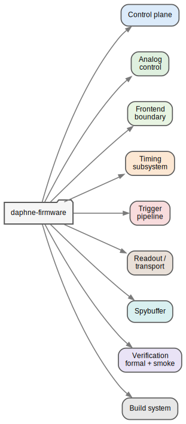
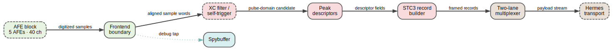
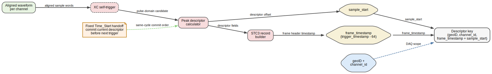
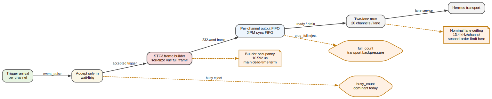

# daphne-firmware

Merged working area for the DAPHNE mezzanine firmware, starting from the
current non-project Vivado flow and audited against the legacy project-mode
snapshot.

## Current status

- Imported the current firmware source tree under the original `ip_repo/` and
  `xilinx/` layout so the Vivado batch flow remains usable.
- Added board configuration indirection for the Kria build scripts through
  `DAPHNE_FPGA_PART`, `DAPHNE_BOARD_PART`, and `DAPHNE_PFM_NAME`.
- Added reusable FuseSoC module cores for common, feature, and platform layers
  while preserving the original generated source manifest and Vivado batch path.
- Added FuseSoC-ready smoke tests around the frontend trigger register block,
  the self-trigger threshold AXI window, and the PL-side board-control
  register block.
- Added formal verification scaffolds for the AXI-Lite leaf blocks where a
  proof has a realistic cost/benefit ratio during the migration.
- Added vendor-neutral delay/FIFO primitives so the isolated self-trigger path
  can be analyzed locally without Vivado `unisim` / `xpm`.
- Recorded the PS-side deployment contract needed by `daphne-server`.
- Qualified a WSL2-driven Windows Vivado/Vitis K26C hardware build flow and
  captured a routed-clean hardware baseline at `a389fcd`.
- Validated the repo-owned overlay load and board bring-up path through the
  clock client, `daphne-server`, and oscilloscope-mode signal visibility on
  hardware.
- Started an additive `rtl/isolated/` scaffolding layer to prepare subsystem
  contracts and future formal harnesses without disturbing the imported blob.
- Started a repo-owned `petalinux/meta-daphne/` scaffold so `system.dtb`,
  overlay install, and service packaging ownership can move into this repo.
- Added terminal-driven PetaLinux project/build wrappers so the repo can create
  a KR260 project, apply the `.xsa`, build the image, and collect the outputs
  into a stable bundle layout.

## Repository layout

- `ip_repo/daphne_ip/`: imported PL RTL, simulation sources, and Hermes/DAQ
  source tree.
- `xilinx/`: imported non-project Vivado scripts, now parameterized by board.
- `cores/tests/`: FuseSoC cores.
- `cores/common/`: reusable shared package/common cores.
- `cores/features/`: reusable feature-block cores plus module-level simulation
  and formal targets.
- `tests/logic/`: HDL smoke tests.
- `boards/`: board metadata and support status.
- `petalinux/`: deployment-side toolchain/dependency notes for the Kria Linux
  environment, including the first `meta-daphne/` layer scaffold.
- `docs/`: source audit, server contract, modular architecture, and gap
  analysis.
- `formal/`: SymbiYosys scaffolds for leaf blocks that are suitable for formal.
- `rtl/isolated/`: neutral subsystem wrapper shells and typed interfaces for the
  isolation/formal-prep phase.

## Quick start

For the current clone-to-products manual, including which host/shell to use,
path-length guidance, and where the final products land, see
`docs/build-manual.md`.

For the high-level project philosophy, module map, scope, stable baseline, and
current TODO list, see `docs/project-overview.md`.

For subsystem provenance and developer ownership across the imported and
repo-owned lanes, see `docs/developer-manifest.md`.

For the reusable architecture figure set and short explanations of each view,
see `docs/architecture-reference.md`.

For the peak-descriptor identity contract and the fixed same-channel
`sample_start` collision mechanism, see
`docs/peak-descriptor-id-uniqueness.md`.

For the current self-trigger dead-time bottleneck chain, including the
builder-versus-transport split and the recommended architecture direction, see
`docs/deadtime-bottleneck-cascade.md`.

## Architecture at a glance

### Subsystem hierarchy



### Runtime acquisition path



### Descriptor identity path



### Dead-time bottleneck cascade



### Logic smoke test with FuseSoC

Requires `fusesoc`, `edalize`, and `ghdl`.
The smoke runner uses isolated per-core build roots under
`build/fusesoc-logic/` by default so one target cannot reuse stale prepared
sources from another target. Override the root with
`DAPHNE_FUSESOC_BUILD_ROOT=/path/to/build-root` if needed.

```bash
./scripts/fusesoc/fusesoc.sh list-cores
./scripts/fusesoc/run_logic_test.sh
```

To run a single smoke test instead of the default suite:

```bash
./scripts/fusesoc/run_logic_test.sh dune-daq:daphne:frontend-test:0.1.0
./scripts/fusesoc/run_logic_test.sh --list-suites
./scripts/fusesoc/run_logic_test.sh --suite composable
./scripts/fusesoc/run_logic_test.sh --suite all-local
```

Run the checked-in formal scaffolds:

```bash
./scripts/formal/run_formal.sh
./scripts/formal/run_formal.sh fe_axi_axi_lite
```

List the checked-in formal jobs without running them:

```bash
./scripts/formal/run_formal.sh --list
```

The formal runner auto-sources `$HOME/tools/oss-cad-suite/environment` when it
exists so the bundled `sby` / `yosys` toolchain can find the GHDL standard
libraries.

Refresh the generated legacy source manifest after editing the imported
RTL/Tcl flow:

```bash
./scripts/fusesoc/refresh_cores.sh
```

### Vivado batch build

The current end-to-end build manual lives in `docs/build-manual.md`. The
commands below are the core qualified entry points.

Current board-supported path:

```bash
export DAPHNE_BOARD=k26c
export DAPHNE_GIT_SHA="$(git rev-parse --short=7 HEAD)"
./scripts/fusesoc/fusesoc.sh run --target=impl dune-daq:daphne:k26c-composable-platform:0.1.0
```

The convenience wrapper now dispatches through the same FuseSoC target:

```bash
export DAPHNE_BOARD=k26c
./scripts/fusesoc/run_vivado_batch.sh
```

This target still preserves the qualified `xilinx/vivado_batch.tcl` flow; the
change is that FuseSoC now owns the top-level entry point and work root.
If you call `fusesoc run` directly, set `DAPHNE_GIT_SHA` first so the legacy
artifact naming keeps the real commit instead of falling back to `0000000`.
The board manifest now defaults the wrapper/build helpers to the supported
platform core, so `run_vivado_batch.sh` and `build_platform.sh` resolve to the
BD-backed board-complete `impl` target unless you override `DAPHNE_PLATFORM_CORE`
explicitly. Today the supported default `impl` lane is the BD/PS-backed
board-complete path with `daphne_selftrigger_bd_wrapper` at the top.
The K26C board manifest also requires `xilinx/afe_capture_timing.tcl` and
`xilinx/frontend_control_cdc.tcl`, so the split frontend timing/CDC model
cannot silently drop out of the build.

The IP packaging Tcl also now accepts top-identity overrides
(`DAPHNE_IP_TOP_HDL_FILE`, `DAPHNE_IP_TOP_MODULE`,
`DAPHNE_IP_COMPONENT_IDENTIFIER`, `DAPHNE_IP_DISPLAY_NAME`,
`DAPHNE_IP_XGUI_FILE`), plus semicolon-separated
`DAPHNE_IP_EXTRA_SOURCE_ROOTS` for additional HDL trees outside
`ip_repo/daphne_ip/rtl`. It still defaults to the legacy packaged top, but the
packager no longer assumes every auxiliary source must live under the imported
legacy tree.

There is now also a FuseSoC-owned composable synth checkpoint that does not go
through the legacy block design:

```bash
./scripts/fusesoc/build_platform.sh --target synth_public_top_ooc
```

That target stages the `daphne_composable_top` source graph through FuseSoC and
runs Vivado out-of-context synthesis on the public composable top. It is an
intermediate milestone: useful to validate the real composable source set in
Vivado, but not yet a board-ready K26C bitstream.

There is now also a first-class Flow API variant of that checkpoint:

```bash
./scripts/fusesoc/build_platform.sh --target synth_public_top_flow
```

That target resolves the same `daphne_composable_top` graph but uses Edalize's
Vivado flow API instead of the deprecated tool-backend entry. It is still OOC
Vivado synthesis rather than a board implementation target, but it is the
first real FuseSoC/flow-owned synth path in the repo.

There is also a board-shell synthesis checkpoint that exercises the
board-facing shell through the explicit bridge graph without the generated
`daphne-ip` core:

```bash
./scripts/fusesoc/build_platform.sh --target synth_board_shell_flow
```

If Vivado runs on a remote server instead of the local workstation, use the
repo-local runbook and wrapper:

```bash
./scripts/remote/run_remote_vivado_chain.sh
```

If you are in WSL2 and Vivado/Vitis 2024.1 are installed on Windows, use:

```bash
./scripts/wsl/check_windows_xilinx.sh
./scripts/wsl/run_wsl_vivado_chain.sh
```

`run_wsl_vivado_chain.sh` is the single-command path. It runs:

- Windows-tool sanity check
- Vivado preflight
- synth/implementation
- DT overlay packaging

On the known-problem WSL host where wrapper behavior is still under repair, the
explicit fallback remains:

```bash
./scripts/wsl/run_manual_vivado_pushd.sh all
```

then, if needed:

```bash
./scripts/package/complete_dtbo_bundle.sh ./xilinx/output-$DAPHNE_GIT_SHA
```

For WSL-driven Windows Vivado runs, keep `DAPHNE_OUTPUT_DIR` unset or set it to
something relative to the staged `xilinx/` directory in the active FuseSoC
work root, for example:

```bash
export DAPHNE_GIT_SHA="$(git rev-parse --short=7 HEAD)"
export DAPHNE_OUTPUT_DIR="./output-$DAPHNE_GIT_SHA"
```

Then expect the main artifacts under:

```text
<work-root>/xilinx/output-<gitsha>/
```

with files such as:

```text
daphne_selftrigger_<gitsha>.bit
daphne_selftrigger_<gitsha>.bin
daphne_selftrigger_<gitsha>.xsa
```

Avoid setting `DAPHNE_OUTPUT_DIR` to a Linux absolute path outside the active
FuseSoC work root when the build runs through Windows Vivado from WSL.

After the build, run the DT overlay packaging step against that work-root
artifact directory:

```bash
./scripts/package/complete_dtbo_bundle.sh <work-root>/xilinx/output-$DAPHNE_GIT_SHA
```

On WSL, this packaging script now auto-loads the Windows `xsct` wrapper if it
is not already on `PATH`.

See `docs/remote-vivado.md`, `docs/wsl-windows-vivado.md`, and
`docs/agent-handoff.md`.

To finish the DT overlay packaging from an existing `.xsa` / `.bin` pair:

```bash
./scripts/package/complete_dtbo_bundle.sh
```

The current isolation/formal-prep structure is described in
`docs/rtl-isolation-plan.md`, the dependency transition is tracked in
`docs/dependency-transition-plan.md`, and the current qualified build
checkpoint is recorded in `docs/build-baseline.md`. The current firmware
artifact boundary is documented in `docs/firmware-delivery.md`.

To drive the repo-owned PetaLinux flow after the hardware handoff is ready:

```bash
./scripts/petalinux/build_kr260_image.sh \
  /path/to/petalinux-project \
  /path/to/hw-handoff-dir \
  --output-dir ./xilinx/output
```

Optional overrides:

```bash
export DAPHNE_FPGA_PART=xck26-sfvc784-2LV-c
export DAPHNE_BOARD_PART=xilinx.com:k26c:part0:1.4
export DAPHNE_PFM_NAME=xilinx:k26c:name:0.0
export DAPHNE_MAX_THREADS=8
```

## Source decisions

The working baseline is the current imported non-project Vivado tree. The
legacy zip was used as a reference source, not as the primary import, because
the current tree already contains the newer non-project flow, the expanded
timing/self-trigger logic, and the integrated Hermes source tree. Details are
recorded in `docs/source-audit.md`.

## FuseSoC structure

- `cores/common/daphne-package.core` provides the shared DAPHNE package.
- `cores/features/*.core` split the design into reusable feature blocks:
  configuration, frontend control, self-trigger logic, timing, spy-buffer,
  AFE/DAC interfaces, and Hermes transport.
- `rtl/isolated/subsystems/frontend/frontend_boundary.vhd` starts capturing the
  frontend alignment contract separately from downstream trigger semantics.
- `cores/common/daphne-subsystem-types.core` carries the neutral typed records
  used by the isolation/formal-prep wrapper layer.
- `cores/common/daphne-subsystem-primitives.core` carries vendor-neutral delay
  and FIFO blocks used to peel Xilinx primitive dependencies out of the
  isolated self-trigger path.
- `cores/features/analog-control.core` captures the AFE/DAC configuration
  readiness boundary that must settle before frontend alignment.
- `cores/features/afe-config-slice.core`,
  `cores/features/afe-analog-island.core`,
  `cores/features/afe-config-bank.core`,
  `cores/features/afe-subsystem-island.core`,
  `cores/features/afe-subsystem-fabric.core`,
  `cores/features/afe-config-slice-boundary.core`,
  `cores/features/afe-capture-slice.core`,
  `cores/features/afe-capture-slice-boundary.core`,
  `cores/features/frontend-register-slice.core`,
  `cores/features/frontend-register-bank.core`,
  `cores/features/frontend-bitlane.core`,
  `cores/features/frontend-capture-bank.core`,
  `cores/features/frontend-registers.core`,
  and `cores/features/frontend-island.core` split the current frontend/AFE path
  into smaller reusable IP blocks while keeping the imported monolithic path
  available.
- `cores/features/control-plane.core`,
  `cores/features/frontend-boundary.core`,
  `cores/features/spy-buffer-boundary.core`,
  `cores/features/timing-subsystem.core`,
  `cores/features/trigger-pipeline.core`, and
  `cores/features/hermes-boundary.core` expose the additive subsystem
  boundaries directly in the FuseSoC graph.
- `cores/features/daphne-composable.core` is the fine-grained subsystem graph
  intended to seed future partial and parameterized gateware builds.
- `cores/features/self-trigger-xcorr-channel.core`,
  `cores/features/peak-descriptor-channel.core`, and
  `cores/features/afe-trigger-bank.core` split the existing one-channel
  self-trigger path into reusable trigger and descriptor slices while keeping
  frame ownership outside the slices for now.
- `cores/features/stc3-record-builder.core`,
  `cores/features/afe-selftrigger-island.core`,
  `cores/features/selftrigger-fabric.core`,
  `cores/features/afe-capture-to-trigger-bank.core`, and
  `cores/features/frontend-to-selftrigger-adapter.core` now capture the first
  composable trigger assembly layers above the per-channel slices.
- The isolated self-trigger graph now analyzes locally through the per-channel
  trigger/descriptor slices, `stc3_record_builder`, AFE trigger bank,
  per-AFE self-trigger island, and the AFE subsystem fabric without Vivado
  vendor libraries.
- `cores/features/daphne-composable-top.core` is the first source-only top
  shell. It currently wires `frontend_island` into the per-AFE adapter/fabric
  path and then into `afe_subsystem_fabric`, so analog configuration and
  self-trigger ownership now line up at the AFE boundary.
- `cores/features/daphne-composable-core-top.core` is the vendor-neutral
  composable shell used for offline validation. It already instantiates the
  timing and Hermes boundary wrappers around the AFE subsystem fabric.
- `cores/features/daphne-composable-frontend-shell.core` is the next shell up:
  it owns the frontend sample handoff into the composable core-top while
  staying vendor-neutral and locally testable.
- `cores/features/daphne-modular.core` remains as the older transitional
  source-graph wrapper. New decomposition work should land in
  `daphne-composable`.
- `daphne-ip.core` is generated from the source-selection rules
  in `xilinx/daphne_ip_gen.tcl` and remains the compatibility path for the
  current K26C Vivado build.
- `daphne-ip-export.core` is the export-only companion manifest generated from
  the same Tcl rules. It stages the legacy HDL/Tcl/XCI tree for board-level
  Flow API targets without loading that tree as active design source.
- `cores/platform/k26c-composable-platform.core` is the single supported K26C
  platform wrapper for the finer-grained subsystem graph. It now exposes a
  GHDL-backed `validate` target so the isolated shell can be compiled and
  smoke-tested without Vivado. Its supported implementation target is the
  BD-backed `impl` lane, plus `synth_public_top_flow`, the first Flow API
  Vivado synth target for the public composable top.
- `scripts/fusesoc/build_platform.sh` now defaults to `impl` for the supported
  K26C platform. Use `--target synth_public_top_flow` when you want the Flow
  API Vivado synthesis checkpoint for the public composable top.
- `scripts/fusesoc/fusesoc.sh` pins the repo-local FuseSoC config and cache
  directories so the workflow does not depend on global user configuration.
- `scripts/fusesoc/run_logic_test.sh` now exercises the module-level smoke
  targets directly.

## Verification posture

- `config-control`, `frontend-control`, and `selftrigger` expose `sim` targets
  backed by GHDL smoke benches.
- `frontend-registers` and `afe-config-slice` expose smaller GHDL smoke targets
  for the isolated control primitives that future partial builds will reuse.
- `afe-interface`, `dac-interface`, and `spy-buffer` expose `sim` targets that
  retain the imported legacy benches under vendor-library simulators such as
  XSim.
- `frontend-registers`, `afe-config-slice-boundary`, `afe-capture-slice-boundary`,
  and `selftrigger` expose checked proof entry points for their interface
  contracts.
- `daphne-composable-core-top` and `k26c-composable-platform` now expose
  vendor-neutral GHDL smoke validation for the isolated shell, including the
  timing and Hermes boundary wrappers.
- `daphne-composable-core-top` and `k26c-composable-platform` also expose
  `sim_optional_off` / `validate_optional_off` targets to check the same shell
  with timing, Hermes, and self-trigger disabled explicitly.
- `daphne-composable-frontend-shell` now exposes a GHDL smoke target, and
  `k26c-composable-platform` mirrors it as `validate_frontend_shell`.
- `daphne-composable-top` now also exposes a GHDL smoke target behind a
  validate-only `frontend_island` stub, and `k26c-composable-platform`
  mirrors it as `validate_public_top`.
- The new trigger/descriptor wrappers are source-only preparation work around
  the imported `trig_xc` and legacy peak-descriptor calculator; they are not yet
  integrated as the top-level frame source.
- Timing, Hermes transport, and the full frontend datapath are documented as
  future formal candidates, not present-day proof targets.

## What is still missing

This is still not a complete multi-board deployment repo. The main remaining
gaps are:

- full repo-owned boot-image generation:
  - `BOOT.BIN`
  - kernel/rootfs bundle
  - full `system.dtb`
- automated PetaLinux handoff from the generated firmware outputs into a
  reproducible board image
- validated carrier support beyond the current K26C baseline
- deeper proof-carrying module contracts and formal coverage beyond the current
  leaf-block scaffolds
- additional regression discipline around future cleanup/refactor work so new
  changes are always measured against the routed-clean `a389fcd` baseline
