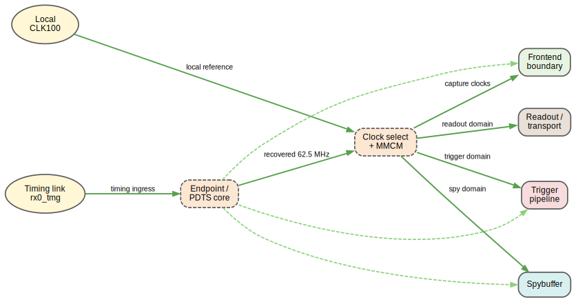
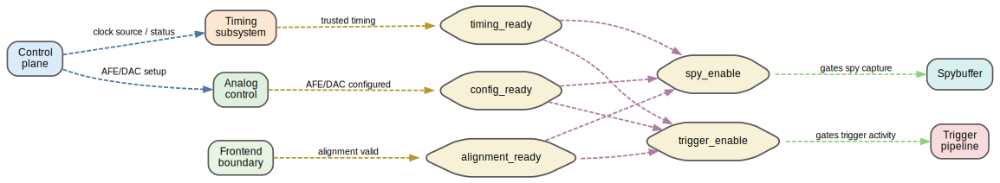
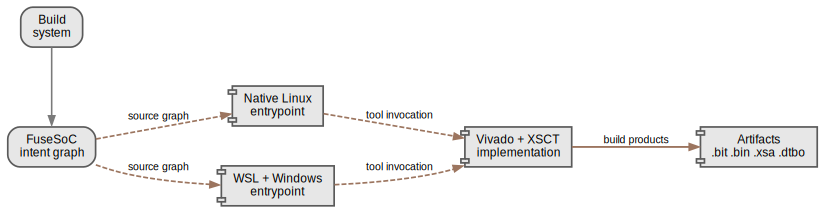

# Architecture Reference

This page is the reusable figure index for the current `daphne-firmware`
architecture.

The diagrams are curated views of the current repo architecture, not one-off
slide art. They are intended to be reused in:

- the README
- the project overview / wiki page
- build and integration notes
- presentations

The current figure set is intentionally split by claim. Each figure answers one
question.

## 1. Subsystem Hierarchy

Question answered:

- what are the major repo-owned and imported architectural blocks?

Interpretation:

- dashed boxes indicate imported or compatibility-lane blocks
- solid boxes indicate repo-owned or wrapper-owned architectural ownership
- the figure is about structural decomposition, not runtime flow

## 2. Runtime Acquisition Path

Question answered:

- how does an AFE sample become a transport payload?

Interpretation:

- the main path is:
  - AFE block
  - frontend boundary
  - XC/self-trigger
  - peak descriptors
  - STC3 record builder
  - two-lane multiplexer
  - Hermes transport
- the spybuffer is intentionally shown as a side observation path, not part of
  the main export chain

## 3. Clock and Timing Topology

Question answered:

- where do the trusted clocks come from, and which subsystems consume them?

Interpretation:

- `Local CLK100` and `rx0_tmg` are the physical clock sources
- the endpoint/PDTS core recovers timing-link information
- clock select + MMCM is the trust boundary for downstream clock consumers
- dashed green edges represent timing qualification rather than direct clock
  distribution

## 4. Readiness Contracts

Question answered:

- what must be true before trigger or spy capture are allowed to mean anything?

Interpretation:

- `config_ready`, `timing_ready`, and `alignment_ready` are modeled as explicit
  architectural states
- `trigger_enable` and `spy_enable` are not independent booleans; they are
  derived enables
- this view is the cleanest summary of the contract work behind the modular and
  formal layers

## 5. Build Flow

Question answered:

- how does the repo turn intent into deliverable firmware products?

Interpretation:

- FuseSoC is the intent layer
- Linux and WSL/Windows are two qualified entrypoint families
- Vivado + XSCT remain the implementation backend
- the current product boundary is:
  - `.bit`
  - `.bin`
  - `.xsa`
  - `.dtbo`
  - overlay bundle and reports

## 6. Descriptor Identity Path

Question answered:

- how is a peak descriptor identified downstream, and where is the
  `sample_start` value produced?

Interpretation:

- the descriptor identity is channel-scoped:
  - `geo_id`
  - `channel_id`
  - `frame_timestamp + sample_start`
- `sample_start` is produced in the peak-descriptor calculator
- `frame_timestamp` comes from the STC3 framing path
- the fixed bug was a same-channel collision in `sample_start`, not a
  cross-channel timestamp-sharing issue
- the detailed failure analysis and fix live in
  [peak-descriptor-id-uniqueness.md](/Users/marroyav/repo/daphne-firmware/docs/peak-descriptor-id-uniqueness.md)

## 7. Dead-Time Bottleneck Cascade

Question answered:

- where does the current self-trigger dead time come from, in cascade order?

Interpretation:

- the current first-order bottleneck is the per-channel STC3 frame builder
- the per-channel FIFO and shared two-lane mux are the next bottlenecks
- transport cleanup is still useful, but it does not remove the dominant
  builder-driven `busy_count` term in the current `10–14 kHz/channel` region
- the detailed table, quantitative split, and recommended architecture changes
  live in
  [deadtime-bottleneck-cascade.md](/Users/marroyav/repo/daphne-firmware/docs/deadtime-bottleneck-cascade.md)

## Notes

- These figures are repo-local rendered copies for documentation use.
- They are meant to stay consistent with the current architecture descriptions
  in `docs/modules/`.
- When expanding to `daphne-server`, `daphnemodules`, or the full DAQ receive /
  decode chain, the intended method is to add nodes, edges, and new views
  rather than redraw the existing figures by hand.
