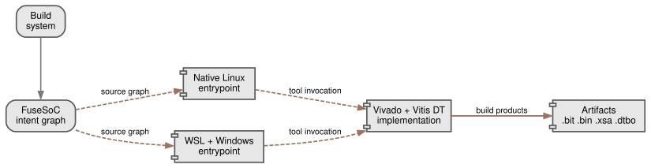

# Build manual

This is the repo-owned build path from `git clone` to the generated firmware
products.

All commands below run from the **repo root** unless a section says otherwise.

The architectural build-flow view is maintained separately in:

- [architecture-reference.md](architecture-reference.md)



## Scope

The release build target is:

- board: `k26c`
- source: an approved immutable release tag or full commit SHA
- tool: Vivado/Vitis 2026.1
- primary build host: Cooper, using native Linux tools

The WSL/Windows wrappers remain supported alternatives. Local developer hosts
are useful for vendor-neutral checks and documentation, but they do not replace
the clean Cooper implementation and package check required for a release.

## Path rules

Keep the repo path short.

Recommended:

- WSL + Windows tools:
  - Windows path: `C:\w\d`
  - WSL path: `/mnt/c/w/d`
- native Linux remote host:
  - `~/w/d`

Avoid:

- deep home-directory paths
- paths with spaces
- long nested build roots

Reason:

- Vivado, XSCT, DTG, and generated IP trees create very deep paths
- the WSL-to-Windows wrapper path is more reliable when the repo is visible
  through a short Windows path

## Clone the repository

Set `RELEASE_REF` to the approved tag or full commit. Do not build a moving
development branch for a release.

### WSL2 + Windows Vivado/Vitis

Run in WSL:

```bash
mkdir -p /mnt/c/w
git clone git@github.com:DUNE-DAQ/daphne-firmware.git /mnt/c/w/d
cd /mnt/c/w/d
git fetch --tags
RELEASE_REF="REPLACE_WITH_APPROVED_TAG_OR_FULL_COMMIT"
git checkout --detach "$RELEASE_REF"
```

### Native Linux host (Cooper)

Run on the remote Linux host:

```bash
mkdir -p ~/w
git clone git@github.com:DUNE-DAQ/daphne-firmware.git ~/w/d
cd ~/w/d
git fetch --tags
RELEASE_REF="REPLACE_WITH_APPROVED_TAG_OR_FULL_COMMIT"
git checkout --detach "$RELEASE_REF"
```

## Optional local sanity checks

Run from the repo root on any host with the local HDL tools installed:

```bash
python3 scripts/check_documentation.py
python3 scripts/check_register_map.py
./scripts/fusesoc/run_logic_test.sh --suite all-local
./scripts/formal/run_formal.sh --suite all-local
```

These are not the hardware build. They only sanity-check the checked-in smoke
and formal targets.

## Full WSL build

Run in WSL from `/mnt/c/w/d`:

```bash
cd /mnt/c/w/d
export DAPHNE_BOARD=k26c
export DAPHNE_ETH_MODE=create_ip
export DAPHNE_GIT_SHA="$(git rev-parse --short=7 HEAD)"
export DAPHNE_OUTPUT_DIR="./output-$DAPHNE_GIT_SHA"
./scripts/wsl/check_windows_xilinx.sh
./scripts/wsl/run_wsl_vivado_chain.sh
```

What this does:

1. checks the Windows Vivado/Vitis wrappers
2. runs packaged-IP preflight when the selected target needs it
3. runs the qualified K26C implementation flow
4. runs DT overlay packaging

Logs go under:

```text
build/wsl-vivado/<timestamp>/
```

Important environment rules:

- keep `DAPHNE_OUTPUT_DIR` unset or relative to `xilinx/`
- do not point `DAPHNE_OUTPUT_DIR` at a Linux absolute path outside the repo
- `DAPHNE_BOARD=k26c` is the qualified board path
- `DAPHNE_ETH_MODE=create_ip` is the qualified Ethernet mode

## Full build on Cooper

Run from the clean detached checkout:

```bash
cd ~/w/d
source /tools/2026.1/Vitis/settings64.sh
export DAPHNE_BOARD=k26c
export DAPHNE_ETH_MODE=create_ip
export DAPHNE_GIT_SHA="$(git rev-parse --short=7 HEAD)"
export DAPHNE_MAX_THREADS=8
export DAPHNE_OUTPUT_DIR="$PWD/xilinx/output-$DAPHNE_GIT_SHA"

./scripts/fusesoc/refresh_cores.sh
git diff --exit-code -- daphne-ip.core daphne-ip-export.core
python3 scripts/check_documentation.py
python3 scripts/check_register_map.py
./scripts/fusesoc/preflight_vivado_build.sh
./scripts/fusesoc/build_platform.sh
./scripts/fusesoc/check_build_outputs.sh \
  "$DAPHNE_OUTPUT_DIR" "$DAPHNE_GIT_SHA"
```

The Linux build includes overlay packaging. A release is blocked unless the
final build-output checker reports `RESULT: PASS`.

## Package existing `.xsa` and `.bin` files

If Vivado implementation already produced:

- `daphne_selftrigger_<gitsha>.xsa`
- `daphne_selftrigger_<gitsha>.bin`

then the repo can finish the overlay bundle from the existing handoff:

```bash
cd /mnt/c/w/d
export DAPHNE_GIT_SHA="$(git rev-parse --short=7 HEAD)"
./scripts/package/complete_dtbo_bundle.sh ./xilinx/output-$DAPHNE_GIT_SHA
```

This is the right recovery step when implementation finished but the overlay
bundle still needs to be generated.

On Windows hosts using the recommended `C:\w\d` clone, the supported
PowerShell wrapper for this recovery path is:

```powershell
cd C:\w\d
.\scripts\windows\package_dtbo_from_existing_xsa.ps1 -GitSha 176ee43
```

That helper runs the known-good two-stage sequence:

- Windows `sdtgen.bat`, or legacy `xsct.bat`, generates `pl.dtsi` from the
  existing `.xsa`
- WSL `complete_dtbo_bundle.sh` compiles the `.dtbo` and overlay zip

Use `-OutputDir` instead of `-GitSha` if you want to package a nonstandard
output directory explicitly.

## Expected build products

The main output directory is:

```text
xilinx/output-<gitsha>/
```

For a successful qualified build, expect at least:

- `daphne_selftrigger_<gitsha>.bit`
- `daphne_selftrigger_<gitsha>.bin`
- `daphne_selftrigger_<gitsha>.xsa`
- `daphne_selftrigger_<gitsha>.dtbo`
- `daphne_selftrigger_ol_<gitsha>/`
- `daphne_selftrigger_ol_<gitsha>.zip`
- `SHA256SUMS`
- implementation reports such as:
  - `post_route_timing_summary.rpt`
  - `post_route_bus_skew.rpt`
  - `post_route_cdc.rpt`
  - `post_route_methodology.rpt`
  - `post_route_status.rpt`
  - `post_route_util.rpt`

## Hardware-proven boundary

The historical repo-owned build and deployment boundary was proven through:

- routed-clean firmware baseline `a389fcd`
- overlay load on target
- clock-client bring-up
- `daphne-server` start
- oscilloscope-mode signal visibility on hardware

That proves the shape of the build-to-overlay flow. It does not qualify the
current 2026.1 branch tip or the full PetaLinux deliverable; both require the
validation gates listed in
[toolchain-upgrade-2026.1.md](toolchain-upgrade-2026.1.md).

## What is outside this manual

This manual ends at the generated firmware products.

Still outside this scope:

- `BOOT.BIN` assembly
- kernel/rootfs image generation
- full `system.dtb`
- automated PetaLinux image handoff and collection

For those next steps, see:

- [petalinux/README.md](../petalinux/README.md)
- [docs/firmware-delivery.md](firmware-delivery.md)
- [docs/remote-vivado.md](remote-vivado.md)
- [docs/wsl-windows-vivado.md](wsl-windows-vivado.md)
