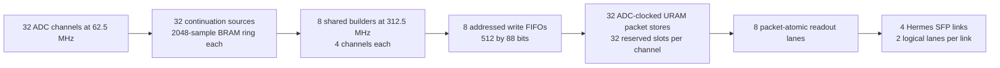

# Fixed512 continuation with four channels per builder

This branch targets **32 active channels, eight shared builders and four physical
10 Gb/s Hermes SFP links**. It starts from the existing grouped implementation
at `4e4aeb8` and incorporates the continuation/four-SFP implementation at
`9e05b7ad3c9b3cc456e17062cfbb6dcf12c98182`. Historical single-SFP grouped wrappers
and their obsolete OOC targets are removed. The production entry point remains
`k26c_board_shell` through the existing K26C build flow.

## Data path



`stc3_frame_source` retains the current channel-local admission, continuation,
calibration tagging, bounded 13-bit sample sequence arithmetic, timestamp epoch
guard, overload accounting and credit policy. A queue head becomes eligible
only after all 512 samples exist. A registered XPM handshake transfers that
head to the shared engine; its ownership lasts until the final header reaches
the acquisition clock domain. Each channel continuously writes its own ring.
Independent-clock BRAM supplies the shared engine's read port.

`afe_stc3_stream_serializer` keeps the earlier grouped design's round-robin
claim/release structure. One engine reads one sample per fast clock, packs using
constant shifts and seven fixed slices, and calculates fragment-local peak
information. It replaces the old 32-sample load/emit staging array. Two-bit
channel selection wraps naturally; no division or general modulo operator is
needed in the scheduler.

Before claiming a descriptor, the engine requires room for 128 addressed writes:
120 record words plus margin for the FIFO's write-count visibility latency.
Payload is written first, then eight header words. The final header carries a
commit bit through the same FIFO as the data. That single acquisition-clock
commit publishes the packet and releases its descriptor. Packet credits return
only after transmission or an explicitly accounted stale-fragment skip.

The write FIFO carries data, slot/word address, local channel, commit and overflow
status. It drains unconditionally into already-reserved packet slots. External
link stalls therefore cannot pause a partially assembled record. Both URAM ports
remain on 62.5 MHz; this avoids an unsupported independent-clock URAM design.

One board-level MMCM generates 312.5 MHz from 62.5 MHz using a 1250 MHz VCO.
Clock lock loss asserts reset; each domain releases reset after eight local
edges. That reset also flushes the Hermes source FIFOs and is synchronized into
each transmit clock to reset packet/UDP state together. Statistics reset does not reset queues, handshakes, descriptors or packet
stores. Acquisition disable lets admitted records finish.

## Capacity and resource intent

| Stage | Continuous demand per four-channel group | Ideal service ceiling |
|---|---:|---:|
| Shared engine | 488,281.25 records/s | 312.5 MHz / 522 = 598,659 records/s |
| Packet-store write bridge | 58.59375 million words/s | 62.5 million words/s |
| Existing output lane | 3.75 Gb/s of record data | 3.93443 Gb/s, including its 122-clock service interval |

The engine uses 512 payload clocks, one read priming clock, eight header clocks
and one dispatch clock: **522 fast clocks per record**. Continuous four-channel
activity uses 81.56% of this engine, 93.75% of the write bridge, and 95.31% of the
output lane. These are distinct margins. Buffering absorbs bursts; it does not
increase sustained link capacity. An 80% lane-load planning limit is approximately
102,459 records/s/channel for balanced traffic; physical-event rate depends on
the number of continuation records per event and event merging.

Structural changes, **not measured post-synthesis utilization**:

- Eight packers and eight fragment descriptor calculators replace 32 of each.
- XC trigger processing remains channel-local with the current physics behavior.
- The shared descriptor arithmetic requests eight DSP adders instead of 32.
- Sample rings retain 32 BRAM36-equivalent memories; packet stores retain 32 URAMs.
- Eight 512-by-88-bit CDC FIFOs add memory; budget up to 16 BRAM36 tiles before
  confirming Vivado's mapping. The handshakes add registers and control logic.
- One additional MMCM and clock distribution are required.
- Spy capture memories and the AFE digital compensator remain outside the active
  design. The historical zero-DSP grouped build is not a comparable resource result.

Actual LUT/FF/memory mapping, 312.5 MHz timing and CDC reports must come from the
next implementation run. No synthesis result is claimed for this change.

## Local verification

```sh
python3 scripts/verification/run_grouped32_tests.py --output-dir build/grouped32-validation
python3 scripts/verification/run_continuation_tests.py
python3 scripts/verification/run_four_sfp_packaging_tests.py
python3 -m unittest discover -s tests/logic -p 'test_*.py'
scripts/fusesoc/check_board_shell_planes.sh
```

The grouped suite applies the existing alignment, continuation, timestamp-edge
and overload benches to a grouped source, then compares 32 grouped sources/eight
builders against 32 native reference builders. Cases include simultaneous activity,
staggered activity with short stalls, a long link stall, dense overlapping forced
triggers, and hard reset/counter reset/acquisition disable. Each output is checked
against the input waveform. Common fragments must match the reference across all
960 bytes. Simulated transport enforces all eight lane mappings and unbroken
120-word records. Overload tests include enough quiet time to drain all 128
records buffered per lane.

GHDL uses explicit behavioral XPM models. They model independent read clocks,
handshake propagation, reset recovery and conservative FIFO counts; they do not
model metastability, physical timing or every vendor macro detail. Package tests
exercise the real staging Tcl with Vivado API fixtures and elaborate the staged
board hierarchy; PHY, XC and clock primitives are boundary stubs in that check.
Vendor XPM/clock elaboration and implementation timing remain lab checks.

The matching XC simulation branch adds `scripts/run_grouped32_rtl_study.py`.
It runs or consumes these actual RTL replays and independently checks descriptors
and waveform/charge retention, using interval unions to avoid counting overlapping
packets twice. The old C++ per-channel timing model is not a grouped timing model.
