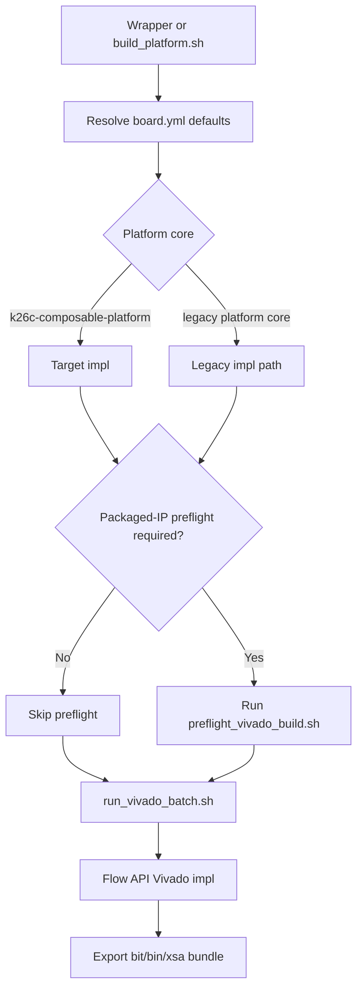
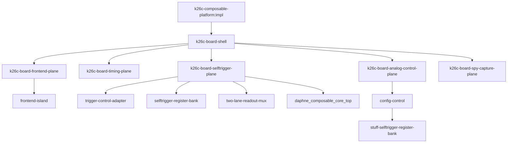

# Native Impl Architecture

This note records the current active FuseSoC-owned implementation path for the
K26C board.

## Build Entry Point

The board manifest now defaults `build_platform.sh` to the composable platform
core and its native `impl` target:

```text
./scripts/fusesoc/build_platform.sh
└─ dune-daq:daphne:k26c-composable-platform:0.1.0
   └─ target=impl
      └─ toplevel=k26c_board_shell
```

For the native composable `impl` target:

- `build_platform.sh` resolves to `k26c-composable-platform:impl`
- `run_vivado_batch.sh` dispatches through the same target
- remote/WSL wrapper chains can skip packaged-IP preflight
- artifact export still lands in the legacy-style
  `daphne_selftrigger_<gitsha>.*` bundle for deployment compatibility

## Preflight Decision Flow



## Active Impl Graph



This is the important current milestone:

- the active `impl` graph is board-plane owned
- `k26c_board_shell` instantiates only explicit board-plane entities
- the active `impl` graph stages with zero `legacy-*` core names
- the required frontend timing constraints remain present:
  - `xilinx/daphne_selftrigger_pin_map.xdc`
  - `xilinx/afe_capture_timing.xdc`
  - `xilinx/frontend_control_cdc.xdc`

## Regression Guard

Use this before or after refactors that touch the active board-shell path:

```bash
./scripts/fusesoc/check_native_impl_graph.sh
```

That script:

- checks that `k26c-board-shell.core` depends only on the explicit board-plane
  feature cores
- checks that `k26c_board_shell.vhd` instantiates only the board-plane
  entities
- stages `k26c-composable-platform:impl`
- locates the generated `*.eda.yml`
- fails if any `legacy-*` core names re-enter the active graph
- fails if the required frontend timing constraints disappear

## What Is Still Not Native

The active board implementation path is native, but the repo still carries
legacy collateral for compatibility:

- packaged-IP generation and export flows
- Tcl/BD-based legacy platform path
- legacy compatibility cores kept for older manifests, simulation, or staged
  migration support

So the native `impl` path is now the default build direction, but the repo is
still deliberately dual-lane until hardware validation on the new path is
routine.
