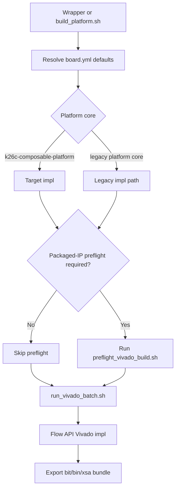
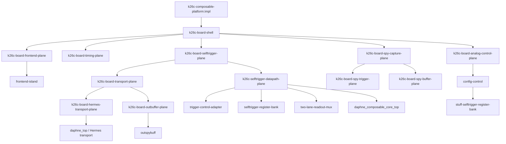

# Native Impl Architecture

This note records the current active FuseSoC-owned implementation path for the
K26C board.

## Build Entry Point

The board manifest now defaults `build_platform.sh` to the board-owned default
platform core and its default native target:

```text
./scripts/fusesoc/build_platform.sh
└─ dune-daq:daphne:k26c-composable-platform:0.1.0
   └─ target=impl
      └─ toplevel=k26c_board_shell
```

For the native composable `impl` target:

- `build_platform.sh` resolves to `k26c-composable-platform:impl`
- `run_vivado_batch.sh` dispatches through the same target
- remote/WSL wrapper chains now decide packaged-IP preflight from the resolved
  platform core and target, so the default native `impl` path and the native
  Flow-API synth targets skip it automatically
- artifact export still lands in the legacy-style
  `daphne_selftrigger_<gitsha>.*` bundle for deployment compatibility

## Preflight Decision Flow



## Active Impl Graph



This is the important current milestone:

- the active `impl` graph is board-plane owned
- the default `k26c-composable-platform` manifest now carries only the native
  board-shell platform collateral; legacy Tcl/export files are explicitly
  segregated as compatibility support instead of part of the main platform
  contract
- the board manifest now keeps only native board defaults in `boards/k26c/board.yml`,
  while the packaged-IP/BD compatibility identity lives in
  `boards/k26c/legacy-flow.yml`
- `k26c_board_analog_control_plane` still instantiates only the imported
  AFE/DAC/control endpoints
- `k26c_board_shell` instantiates only explicit board-plane entities
- `k26c_board_frontend_plane` still instantiates only `frontend_island`
- `k26c_board_selftrigger_plane` now instantiates only explicit datapath and
  transport subplanes
- `k26c_board_transport_plane` now instantiates only explicit Hermes and
  outbuffer subplanes
- `k26c_board_spy_trigger_plane` remains self-contained and board-local
- `k26c_board_spy_buffer_plane` still instantiates only `spy_buffer_boundary`
  plus the live `spybuffers`
- `k26c_board_spy_capture_plane` now instantiates only explicit spy-trigger
  and spy-buffer subplanes
- `k26c_board_timing_plane` still instantiates only the imported `endpoint`
- the active `impl` graph stages with zero `legacy-*` core names
- the board timing-path defaults now cover both the native board-shell
  hierarchy and the packaged-IP/BD hierarchy
- the required frontend timing constraints remain present:
  - `xilinx/daphne_selftrigger_pin_map.xdc`
  - `xilinx/afe_capture_timing.xdc`
  - `xilinx/frontend_control_cdc.xdc`

## Regression Guard

Use this before or after refactors that touch the active board-shell path:

```bash
./scripts/fusesoc/check_native_impl_graph.sh
```

That script:

- checks that `k26c-board-shell.core` depends only on the explicit board-plane
  feature cores
- checks that `k26c_board_shell.vhd` instantiates only the board-plane
  entities
- checks that `k26c-board-analog-control-plane.core` depends only on the
  imported AFE/DAC/control endpoints
- checks that `k26c_board_analog_control_plane.vhd` instantiates only
  `spim_afe`, `spim_dac`, and `stuff`
- checks that `k26c-board-frontend-plane.core` depends only on
  `frontend-island`
- checks that `k26c_board_frontend_plane.vhd` instantiates only
  `frontend_island`
- checks that `k26c-board-selftrigger-plane.core` depends only on the explicit
  datapath and transport subplanes
- checks that `k26c_board_selftrigger_plane.vhd` instantiates only those
  subplanes
- checks that `k26c-board-transport-plane.core` depends only on the explicit
  Hermes and outbuffer subplanes
- checks that `k26c_board_transport_plane.vhd` instantiates only those
  subplanes
- checks that `k26c-board-spy-trigger-plane.core` remains dependency-free
- checks that `k26c_board_spy_trigger_plane.vhd` remains self-contained and
  board-local
- checks that `k26c-board-spy-buffer-plane.core` depends only on the explicit
  spy boundary plus the live `spy-buffer`
- checks that `k26c_board_spy_buffer_plane.vhd` instantiates only
  `spy_buffer_boundary` and `spybuffers`
- checks that `k26c-board-spy-capture-plane.core` depends only on the explicit
  spy-trigger and spy-buffer subplanes
- checks that `k26c_board_spy_capture_plane.vhd` instantiates only those
  subplanes
- checks that `k26c-board-timing-plane.core` depends only on the imported
  `timing-endpoint`
- checks that `k26c_board_timing_plane.vhd` instantiates only `endpoint`
- checks that the board timing-path defaults still name both the native
  board-shell hierarchy roots and the packaged-IP/BD hierarchy roots consumed
  by `xilinx/afe_capture_timing.xdc`
- stages `k26c-composable-platform:impl`
- locates the generated `*.eda.yml`
- fails if any `legacy-*` core names re-enter the active graph
- fails if the required frontend timing constraints disappear

## What Is Still Not Native

The active board implementation path is native, but the repo still carries
legacy collateral for compatibility:

- packaged-IP generation and export flows
- explicit `legacy_*` board-manifest identity keys for the packaged-IP/BD lane,
  so the native board-shell defaults no longer have to masquerade as
  `daphne_selftrigger_*` names
- Tcl/BD-based legacy platform path
- legacy compatibility cores kept for older manifests, simulation, or staged
  migration support

So the native `impl` path is now the default build direction, but the repo is
still deliberately dual-lane until hardware validation on the new path is
routine.
