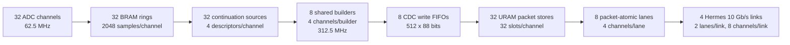

# K26C grouped32 firmware approval report

**Review date:** 2026-09-15

**FPGA source candidate:** `26bb2295ac459a2f621abc66e4e4e8f91bcf55f9`

**Evidence branch:** `codex/selftrigger-512-32ch-grouped4`

**Target:** K26C, AFE5808A in 16-bit LVDS mode at 62.5 MHz

**Tool:** Vivado 2026.1

## Requested disposition

The evidence supports approval of `26bb229` for **FPGA design review and the
next controlled lab-qualification step**. It does not yet support final board
timing sign-off or a production/deployment release.

| Approval area | Proposed status | Evidence or condition |
| --- | --- | --- |
| Architecture and packet format | Approve | Active 32-channel grouped design is documented and replayed against the native reference. |
| RTL functional verification | Approve | Exact-`26bb229` five-mode replay passes and preserves every count, latency, and packet hash from the earlier pinned regression. |
| Contract-level formal verification | Approve within stated scope | Exact candidate passes 30/30 checked-in jobs. Primitive-heavy datapaths and complete subsystems are explicitly outside the proof boundary. |
| Internal FPGA timing, routing, and CDC | Approve for this implementation | Routed timing passes setup, hold, pulse width, and all 87 bus-skew checks; route and DRC have zero errors. |
| AFE external timing | Hold | The design has 41 inputs and 51 outputs without external delays. Exact AFE/PCB min/max timing is unavailable and AFE capture input-delay constraints remain disabled. |
| Hermes/XXV deployment | Hold | Mandatory XXV license features are reported unavailable; no four-link hardware traffic test has been run. |
| Hardware release | Hold | No FPGA was programmed and no AFE capture or four-link line-rate qualification has been performed on hardware. |

## Architecture under review



The active design contains:

| Item | Count and mapping |
| --- | --- |
| Active ADC channels | 32 |
| Sample ring buffers | 32 independent BRAM rings, one per channel, 2,048 samples each |
| Trigger/continuation sources | 32, with a four-entry descriptor queue per channel |
| Shared frame builders | 8, round-robin across four channels each |
| Builder clock | 312.5 MHz from one board-level MMCM; ADC/storage clock is 62.5 MHz |
| Builder-to-store CDC FIFOs | 8 addressed 512-by-88-bit FIFOs |
| Packet stores | 32 URAM stores, one per channel, 32 reserved record slots each |
| Logical output lanes | 8 packet-atomic lanes, four channels per lane |
| Physical links | 4 Hermes 10 Gb/s SFP links, two logical lanes and eight channels per link |

| Physical link | ADC channels | Logical lanes | GT channel | IPv4 suffix |
| --- | --- | --- | --- | --- |
| SFP 0 | 0--7 | 0, 1 | `GTHE4_CHANNEL_X0Y4` | `.100` |
| SFP 1 | 8--15 | 2, 3 | `GTHE4_CHANNEL_X0Y5` | `.101` |
| SFP 2 | 16--23 | 4, 5 | `GTHE4_CHANNEL_X0Y7` | `.102` |
| SFP 3 | 24--31 | 6, 7 | `GTHE4_CHANNEL_X0Y6` | `.103` |

The four GT channels share `GTHE4_COMMON_X0Y1`. Within each link, the first
logical lane serves the lower four-channel block and the second serves the
upper four-channel block. Each lane performs packet-level round-robin
multiplexing across its four channels; records are never interleaved by word.

Each record is 960 bytes: 512 original 14-bit samples packed into 112 64-bit
words followed internally by eight 64-bit header/descriptor words. Readout
exposes the existing header-first 120-word record. A continuation fragment
advances the waveform grid by exactly 512 samples, or 8.192 microseconds.

Each channel writes continuously into its own ring. Admission reserves an
entire packet-store slot before work starts. A shared builder reads one sample
per 312.5 MHz clock, calculates fragment-local peak descriptors, writes the
payload, then writes the eight headers. The final header carries the commit,
which publishes the complete record and returns ownership. The CDC FIFO drains
into an already-reserved slot without depending on link readiness, so a link
stall cannot stop a partially assembled record.

The lane scheduler starts a record only when the downstream path has room for
all 120 words. It holds packet ownership until admission and preserves packet
atomicity. A stalled lane is independent of the other seven lanes. Credits
return after transmission or an explicitly counted stale-fragment skip.

Acquisition disable stops new requests and permits accepted records to finish.
Statistics reset does not reset queues, ownership, descriptors, or packet
stores. A link or software reset can flush records that have already left the
acquisition accounting boundary, so the acquisition counters alone are not an
end-to-end delivery guarantee across those resets.

## Simulation and executable verification

### Packet replay

The exact-candidate five-mode GHDL replay produced 15,956 grouped packets
and 15,682 native-reference packets. An independent oracle decoded and checked
16,198,656 samples and 379,656 descriptor words. All 13,180 packets common to
the grouped and reference outputs were byte-identical across all 960 bytes.

| Mode | Grouped | Reference | Common byte-identical | Maximum grouped latency |
| ---: | ---: | ---: | ---: | ---: |
| 0 | 3,392 | 3,392 | 3,392 | 1,124 ADC clocks = 17.984 us |
| 1 | 3,372 | 3,372 | 3,372 | 1,122 ADC clocks = 17.952 us |
| 2 | 2,224 | 2,200 | 2,200 | 35,027 ADC clocks = 560.432 us |
| 3 | 3,672 | 3,446 | 944 | 3,017 ADC clocks = 48.272 us |
| 4 | 3,296 | 3,272 | 3,272 | 1,124 ADC clocks = 17.984 us |

The deterministic input uses all 32 channels. Even channels have baseline
8,000 with negative pulses, and odd channels have baseline 4,000 with positive
pulses. Active amplitude is `200 + (sample_index*13 + channel*17) mod 1500`;
every third channel has a repeating 32-active/8-quiet sample pattern. The
activity threshold is 64 ADC counts and quiet termination requires 32 samples.

| Mode | Input and benchmark purpose |
| ---: | --- |
| 0 | All channels start together with links ready: continuous continuation at the maximum simultaneous group demand. |
| 1 | Channel starts are seven ADC clocks apart and links stall for 20 of every 4,096 clocks: arbitration and short backpressure with zero expected loss. |
| 2 | All lanes are blocked from ADC clocks 2,000 through 35,999: store exhaustion, whole-fragment loss, long queued latency, drain, and recovery. |
| 3 | Continuation is disabled and forced triggers arrive every 64 clocks with channel-dependent phase: dense overlap and overload accounting. |
| 4 | Hard reset, statistics reset, acquisition disable/re-enable, and additional recovery triggers exercise control semantics. |

Modes 0 and 1 have zero loss and continuous 512-sample chains. The overload
modes validate every emitted record and require rejected data to be accounted
as whole fragments; partial records and shifted continuation grids are not
accepted behavior. Mode 4 exercises hard reset, counter reset, and acquisition
disable. In dense mode 3 the grouped and native architectures make different
admission/scheduling decisions, so common-packet byte identity, waveform
oracle checks, and explicit loss accounting are the applicable comparisons;
equal packet sets are not expected.

Vivado 2026.1 XSIM also ran the AMD XPM memory, CDC, and FIFO models on mode 0
at a 700 ps clock-phase offset. Eight reset/serializer/continuation cases
passed. The packet oracle checked 3,392 grouped plus 3,392 reference packets,
3,473,408 samples, and 81,408 descriptor words with all packets byte-identical
and zero loss.

After the earlier pinned replay, `e70df6a` pipelined writes inside the descriptor
calculator. `f3d84ab` then repaired routed timing crossings and `26bb229`
registered XXV RX status before its TX-clock synchronizer. The new replay's
source manifest matches every tested file directly to `26bb229`. All five
packet counts, common/unique splits, maximum latencies, and CSV hashes are
identical to the earlier replay, closing the descriptor-pipeline regression
gap. The exact candidate also passes the focused Hermes clock/reset test, all
four board-top elaborations, and the seven-target FuseSoC/GHDL `all-local`
suite.

### What simulation establishes

The tests cover record packing, all 512 decoded samples, descriptor values,
odd/even ring starts, continuation and quiet termination, timestamp edges and
wrap, simultaneous and staggered activity, link stalls, dense overlapping
triggers, round-robin service, credit behavior, reset, disable, counter reset,
board packaging, and packet atomicity.

Behavioral XPM models do not model metastability, physical clock/data timing,
or every vendor macro detail. The AMD-model run improves memory/CDC-model
coverage, while routed timing and hardware tests remain separate evidence.
The test starts from correctly captured and aligned 14-bit sample words; it
does not simulate AFE analog response, LVDS eye/jitter, PCB skew, or the input
deserializer. It also is not a detector event-distribution benchmark, and its
wall-clock runtime is not a gateware throughput measurement.

## Formal-method results

The exact `26bb229` inventory passes **30/30 formal jobs with zero failures**.
The jobs use SymbiYosys/Yosys, GHDL synthesis, Z3, bounded cover, base-case
checks, and k-induction as appropriate. GitHub Formal run `34932598031` also
passed all five executed matrix jobs; its aggregate job was skipped as
expected.

The checked properties include:

- AXI-Lite reset values, full-write-strobe policy, readback, and pulse
  self-clear behavior;
- readiness/reset gate equivalence and progress;
- per-AFE configuration and capture safety at the wrapper boundary;
- frontend-to-self-trigger channel order and 16-to-14-bit truncation;
- fixed and configurable delay-line contracts;
- timing and Hermes boundary forwarding;
- composable top/shell seam equivalence and bounded reachability; and
- analog-control reset release plus neutral behavior of remaining stubs.

The proofs are contract-level. They do not formally prove `front_end`,
`febit3`, the spy memory datapath, PDTS endpoint internals, the complete Hermes
transport, the full self-trigger/continuation algorithm, the shared builder,
the packet store, or the Xilinx primitive implementations. Those areas are
covered by simulation, implementation analysis, or remain hardware work.

## Dead time, capacity, and overload behavior

The historical `docs/deadtime-bottleneck-cascade.md` analyzes the replaced
40-channel design with one serialized builder per channel. Its 16.592 us fixed
builder-busy interval and 10--14 kHz/channel table do not describe this active
grouped32 implementation.

The grouped design decouples trigger acceptance from record serialization by
using a ring and a four-entry descriptor queue per channel. There is no fixed
16.592 us trigger dead time in the current architecture. Admission loss occurs
when descriptor/retention checks fail or a packet-store credit is unavailable.
A rejected continuation is counted as one whole 512-sample fragment; it cannot
produce a partial packet. The following limits apply to continuous fragment
traffic:

| Stage | Demand for four continuously active channels | Service ceiling | Utilization |
| --- | ---: | ---: | ---: |
| Shared builder | 488,281.25 records/s | 312.5 MHz / 522 = 598,659 records/s | 81.56% |
| Packet-store write bridge | 58.59375 million words/s | 62.5 million words/s | 93.75% |
| Output lane | 3.750 Gb/s record data | 3.93443 Gb/s | 95.31% |

One builder record takes 522 fast clocks, or 1.6704 us: 512 payload clocks,
one read-prime clock, eight header clocks, and one dispatch clock. One channel
producing a continuous waveform requests 122,070.3125 records/s. The output
lane is therefore the narrowest sustained stage and has about 4.69% record-data
headroom at the absolute continuous four-channel load. Ethernet protocol and
system-level operating margin must still be included in the deployment budget.

The documented 80% lane planning limit is approximately 102,459 records/s per
channel for balanced traffic. If an average physical event occupies `F`
continuation records, its planning limit is approximately `102,459 / F`
events/s/channel before applying any additional experiment margin. Event
merging changes this relationship because overlapping triggers can share
records.

Each channel's 32 packet slots hold 262.144 us of continuous record production
if considered without drain; its 2,048-sample ring spans 32.768 us. These are
burst/retention capacities, not added sustained bandwidth. The replay's
17.952--17.984 us maximum latency in non-overload modes includes window
availability, building, buffering, and simulated service. The 560.432 us
maximum in the long-stall case demonstrates queued recovery rather than a
guaranteed latency bound.

The exact dead-time fraction for physics data depends on trigger arrival
statistics, continuation length, event overlap, channel balance, and link
stalls. The present evidence proves zero loss in the two nominal replay modes
and correct counted whole-fragment rejection/recovery under tested overload.
It does not yet provide a statistically qualified dead-time curve for the
experiment's expected event distribution. Approval should require a replay
using the agreed detector trace/rate model and acceptance thresholds if a
numerical dead-time requirement is part of the release specification.

Operationally, software may change trigger polarity, thresholds, continuation
parameters, and channel enables only while acquisition is stopped. It must
allow the crossings to settle before enabling acquisition and hold these
values stable while running. The register bank does not enforce this protocol
in hardware.

## Implementation, timing, routing, and CDC

Vivado 2026.1 completed synthesis, placement, routing, post-route physical
optimization, bit/bin generation, XSA export, and DTBO/overlay packaging for
`26bb229`. The build used the K26C target, four Hermes PHY paths, up to eight
Vivado threads, and `2100@xilinx-lic`.

| Routed check | Result |
| --- | ---: |
| Setup | WNS +0.073 ns; TNS 0; 0/374,087 failing endpoints |
| Hold | WHS +0.009 ns; THS 0; 0/368,159 failing endpoints |
| Pulse width | WPWS +0.280 ns; TPWS 0; 0/94,713 failing endpoints |
| Bus skew | 87/87 pass; minimum slack +1.379 ns |
| Routing | 206,131/206,131 routable nets fully routed; zero errors/unrouted/partial/overlap |
| DRC | Zero errors; 842 warnings |

The 842 DRC warnings comprise 832 DSP input-pipelining advisories, eight RAM
collision advisories, one vendor I/O-placement warning, and one no-routable-load
warning. They are retained in the evidence rather than waived silently.

| Resource | Used | Available | Utilization |
| --- | ---: | ---: | ---: |
| CLB LUT | 96,343 | 117,120 | 82.26% |
| CLB registers | 83,395 | 234,240 | 35.60% |
| CLB placements | 14,623 | 14,640 | 99.88% |
| BRAM tiles | 91 | 144 | 63.19% |
| URAM | 32 | 64 | 50.00% |
| DSP | 832 | 1,248 | 66.67% |

Although logical LUT use is 82.26%, physical CLB occupancy is 99.88%. The
current route closes, but this leaves little placement freedom for future
changes and makes any source/tool/constraint change a new implementation
qualification rather than a minor revision.

An independent checkpoint reopen reproduced timing and routing and generated a
complete 117,618-row/bit CDC report without a truncation warning. The four
formerly unexcepted combinational XXV RX-status crossings are gone. Their
replacements are depth-two `ASYNC_REG` synchronizers classified `CDC-3`, with
no timing exception. The remaining `CDC-10` rows are false-pathed. Eight
unexcepted `CDC-11` rows are one registered reset level feeding two separate
three-stage synchronizer chains in each of four XXV wrappers; this is the
intentional reset topology.

`check_timing` reports no unclocked, constant-clock, multiply-clocked, or
unconstrained internal register endpoints. It does report 41 input ports and
51 output ports without external delays. The internal timing result must not
be interpreted as external AFE interface closure.

## Board timing status

The reviewed CERN EDMS package is `3434842_1.zip`, SHA-256
`6579edc9191ed4fcc70989c6a1acb99754f510ac2afa1dcd8a2c8af1dca0174e`.
It identifies DAPHNE Mezz V2 schematic drawing 177020 revision 0 and a 14-layer
FR408HR PCB specification with 100-ohm differential LVDS impedance, +/-10%.
Its proposed stackup gives nominal differential propagation of 135.531 ps/in
on top/bottom layers and 164.931 ps/in on internal layers.

The package does not contain a native PCB database, Gerbers, a routed-net
length table, per-net flight times, or final fabricated stackup. Final timing
still needs the FPGA-to-clock-fanout and fanout-to-AFE clock paths plus all 45
AFE-to-FPGA data/FCLK differential-pair lengths, routing layers, via effects,
and tolerances. The clock fanout is a TI CDCUN1208LPRHBR. Its data sheet gives
35 ps typical/50 ps maximum output skew for identically configured and loaded
outputs, which must be combined with board-route mismatch.

The confirmed AFE mode is 16-bit at 62.5 MHz, giving 1.000 Gb/s per LVDS data
lane. The available AFE5808A data sheet does not characterize output timing at
this exact 1 Gb/s operating point. The native Altium project and its per-net
reports therefore remain required; access to the Fermilab on-prem Altium
project is awaiting approval. `DAPHNE_AFE_CAPTURE_INPUT_DELAY_ENABLE` must
remain disabled until a reviewed min/max timing model is available.

## License and hardware status

Vivado checked out the K26C `Synthesis` feature from `2100@xilinx-lic`, and the
complete artifact flow exited successfully. During XXV IP generation and
synthesis, however, Vivado reported mandatory features
`xxv_eth_mac_pcs@2026.06`, `xxv_eth_basekr@2026.06`, and
`xxv_tsn_802d1cm@2026.06` unavailable. Successful bitstream creation does not
establish licensed or functional XXV operation.

No FPGA has been programmed with this candidate. There is no recorded hardware
test of AFE sampling/alignment, trigger efficiency, record contents, four-link
bring-up, sustained line rate, link stalls, resets, or end-to-end loss
accounting.

## Conditions to close final approval

1. Obtain approved Altium project access or a board-owner export of the exact
   per-net lengths/flight times and final fabricated stackup for drawing
   177020 revision 0.
2. Produce and review min/max AFE clock/data/FCLK constraints for the confirmed
   16-bit, 62.5 MHz mode, then rerun implementation with external I/O timing
   enabled.
3. Resolve the XXV IP entitlement and rebuild in the authorized environment.
4. Run a controlled K26C/DAPHNE Mezz V2 hardware qualification: AFE alignment
   and capture, known-pattern data integrity, all four links, sustained and
   burst load, deliberate stalls, reset/recovery, and counter reconciliation.
5. Run the agreed detector-like stochastic trace and report accepted triggers,
   merged triggers, whole-fragment rejects, packet loss, latency distribution,
   and dead-time fraction against explicit acceptance limits.

## Reproduction and primary evidence

Run the exact-revision local checks from a clean checkout:

```sh
git checkout 26bb2295ac459a2f621abc66e4e4e8f91bcf55f9
./scripts/formal/run_formal.sh --suite all-local
./scripts/fusesoc/run_logic_test.sh all-local
python3 scripts/verification/run_grouped32_tests.py --output-dir build/grouped32-approval
python3 scripts/verification/run_continuation_tests.py
python3 scripts/verification/run_four_sfp_packaging_tests.py
```

Verify the committed implementation/audit evidence:

```sh
(cd docs/reports/grouped32/impl-20260915-26bb229 && sha256sum -c SHA256SUMS)
(cd docs/reports/grouped32/audit-routed-26bb229-20260915 && sha256sum -c SHA256SUMS)
```

Primary records:

- [Pinned implementation evidence](impl-20260915-26bb229/README.md)
- [Independent routed checkpoint audit](audit-routed-26bb229-20260915/README.md)
- [Exact-candidate five-mode packet replay](replay-five-mode-26bb229-20260915/README.md)
- [AMD XPM vendor-model replay](vendor-mode0-5d83890-20260914/README.md)
- [AFE5808A timing review](afe5808a-timing-review-20260914.md)
- [K26C EDMS/PCB package review](k26c-edms-timing-source-20260915.md)
- [XXV license review](xxv-license-review-20260914.md)
- [Grouped32 implementation description](../../grouped32-implementation.md)
- [Formal proof inventory and scope](../../../formal/README.md)
